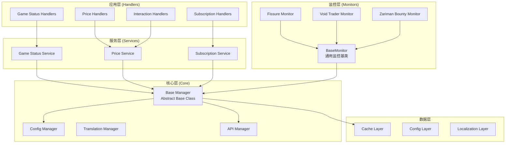

## 项目概述

对 Warframe 游戏机器人项目进行全面的代码优化和重构，提升代码质量、可维护性和健壮性。

## 核心问题

1. **群组 ID 硬编码**：5+ 处硬编码群组 ID
2. **监控器类重复代码**：FissureMonitor、VoidTraderMonitor、ZarimanBountyMonitor 三类重复度达 70%+
3. **异常处理模板重复**：31 处重复的 try-except 块
4. **魔法数字**：25+ 处未命名的常量
5. **类型注解缺失**：40% 方法缺少类型注解
6. **无单元测试**：项目缺乏自动化测试
7. **Manager 耦合度高**：直接依赖具体实现而非抽象

## 优化目标

- 消除代码重复，遵循 DRY 原则
- 提升类型安全，添加完整类型注解
- 抽离魔法数字为配置常量
- 建立统一的异常处理机制
- 实现解耦的架构设计
- 引入单元测试和集成测试

## 技术栈

- **语言**：Python 3.11+
- **框架**：NoneBot2
- **异步**：asyncio
- **类型检查**：mypy
- **测试框架**：pytest + pytest-asyncio
- **代码规范**：flake8、black

## 架构设计

### 系统架构图

## 实现策略

### 阶段一：基础设施搭建

1. 创建基础配置模块 `config/base_config.py`，抽离所有魔法数字
2. 创建基础管理器抽象类 `core/base_manager.py`
3. 创建统一的异常处理器 `utils/exception_handler.py`
4. 创建通用监控器基类 `core/monitor_base.py`

### 阶段二：代码重构

1. 重构监控器类，继承通用基类，消除 150+ 行重复代码
2. 重构异常处理，使用装饰器统一处理
3. 添加完整类型注解（managers 和 handlers）
4. 抽离硬编码群组 ID 到配置

### 阶段三：测试与验证

1. 为核心模块编写单元测试
2. 为关键路径编写集成测试
3. 引入 CI/CD 流程
4. 性能基准测试

## 关键技术决策

### 1. 监控器重构 - 模板方法模式

- 创建 `BaseMonitor` 抽象基类，定义 `start()`、`stop()`、`check()` 模板方法
- 子类实现具体的 `fetch_data()` 和 `process_data()` 方法
- 统一循环逻辑、错误处理、通知机制

### 2. 异常处理 - 装饰器模式

- 创建 `@handle_exception` 装饰器，统一异常捕获和日志记录
- 消除 31 处重复的 try-except 块
- 提供统一的错误响应格式

### 3. 配置管理 - 分层配置

- 环境配置：`config/env_config.py`
- 应用配置：`config/app_config.py`
- 业务配置：`config/business_config.py`
- 支持环境变量覆盖

### 4. 群组 ID 管理 - 订阅配置

- 将所有群组 ID 迁移到 `data/subscriptions.json`
- 支持动态加载和运行时更新
- 提供订阅管理 API

### 性能考虑

- 监控器轮询间隔使用指数退避策略
- API 请求添加缓存层，TTL 1 小时
- 异步任务批量处理，减少事件循环压力
- 图片生成使用对象池复用资源